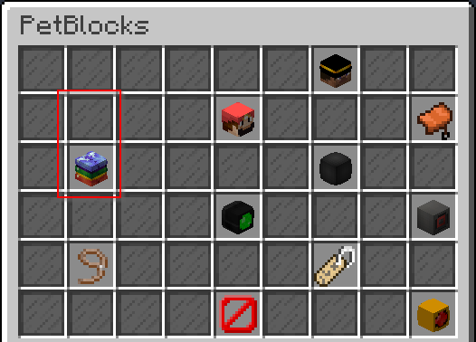

Edit GUI page
=============

Make sure you have understood the image below, otherwise go back to the previous page.

.. image:: ../_static/images/gui-pagesconfig.png

Changing the main page
~~~~~~~~~~~~~~~~~~~~~~

There are lots of complex items on the **main** page so to keep things simply we start by taking a look at the **wardrobe** item on the **main page**.

The name of the item **wardrobe is not** related to the **page wardrobe** it can be named like you want. The only restrictions is that the name has to be unique on the main page.

**config.yml**
::
    gui:
      main:
        wardrobe:
          row: 2
          col: 2
          script: 'open-page gui.wardrobe'
          permission: 'open.wardrobe'
          icon:
            id: 397
            damage: 3
            skin: 'textures.minecraft.net/texture/55507d6517eff952dd38fa8bc551dd6d6a7a5e4ea134519b44650ac1ffa59c3'
            name: '&6&lPet Customization <permission>'
            lore:
            - '&7Change the appearance of your pet. <permission>'

.. image:: ../_static/images/gui-pageselectwardrobe.png

Changing row and column
~~~~~~~~~~~~~~~~~~~~~~~

Take a look at the first options **row** and **col**.

The GUI is basically a grid view which has got items at a certain row and column.

Let's increase the row value by one.

**config.yml**
::
    gui:
      main:
        wardrobe:
          row: 3
          col: 2
          script: 'open-page gui.wardrobe'
          permission: 'open.wardrobe'
          icon:
            id: 397
            damage: 3
            skin: 'textures.minecraft.net/texture/55507d6517eff952dd38fa8bc551dd6d6a7a5e4ea134519b44650ac1ffa59c3'
            name: '&6&lPet Customization <permission>'
            lore:
            - '&7Change the appearance of your pet. <permission>'

Changing the icon
~~~~~~~~~~~~~~~~~

Let's ignore the **script** and **permission** tag for now because they are more complex to understand.

Take a look at the **icon** tag. This tag contains all available options to describe the item in the GUI.

* Id 397 is the id of a skull
* Damage 3 is the damage for a player skull
* Skin is the skin for the player skull
* Name is the displayname of the item.
* Lore can accept multiple lines for the lore of the item.

.. note:: Please take a look at the skin page to understand how the **skin tag works** and how to use **custom skins**.

**config.yml**
::
    gui:
      main:
        wardrobe:
          row: 3
          col: 2
          script: 'open-page gui.wardrobe'
          permission: 'open.wardrobe'
          icon:
            id: 397
            damage: 3
            skin: 'textures.minecraft.net/texture/55507d6517eff952dd38fa8bc551dd6d6a7a5e4ea134519b44650ac1ffa59c3'
            name: '&6&lPet Customization <permission>'
            lore:
            - '&7Change the appearance of your pet. <permission>'

