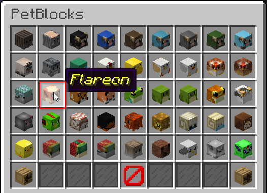

Minecraft-Heads.com Categories
==============================

You can find the sponsored categories on the wardrobe page of PetBlocks. The sponsored skins are split
into 3 categories. Pet skins, vehicle skins and plushie skins.

.. image:: ../_static/images/minecraftheads-categories.png

Usage ingame
~~~~~~~~~~~~

1. Click on any Minecraft-Heads.com category.

.. image:: ../_static/images/minecraftheads-categoryselect.png

2. Select any skin you like.

Configuring in the config.yml
~~~~~~~~~~~~~~~~~~~~~~~~~~~~~

Each of the category has got its own page in the GUI.

**config.yml tags**
::
    minecraft-heads-pet-skins:
    minecraft-heads-puppet-skins:
    minecraft-heads-vehicle-skins:

A single item looks like this:

**config.yml**
::
    block-1-1:
      row: 1
      col: 1
      icon:
        id: 397
        damage: 3
        name: 'minecraft-heads.com/1'
        skin: 'minecraft-heads.com/1'
      set-skin:
        id: 397
        damage: 3
        skin: 'minecraft-heads.com/1'

.. note:: You can **change the name** or lore of the icon in the GUI **in the same way** as any other item.

.. note:: The name or skin **minecraft-heads.com/1** queries the internal minecraft-heads.com database for an indexed skin which results into a **sponsoring message** when clicking on it. This means you can even **use sponsored skins** in your **own categories**.

* Row, Column: Specifies the location of the item in the GUI grid.
* Icon: Specifies the rendered icon in the GUI.
* Set-skin: Specifies the skin a pet receives when clicking on it.