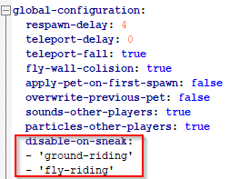
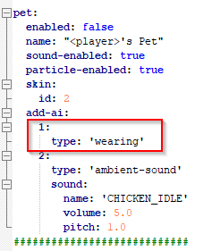

Example: Always applying the wearing ai
=======================================

As you should already know all pet behaviours are represented as an abstract level called ai
to the user. This also means the 'wearing' ai gets represented like that.

Goal
~~~~

* Force the pet to be always shown on top of the head of the player.
* Inspiration comes the game called 'Pokémon: Let's Go' where the main pokemon is always riding on the player.

.. image:: https://files.pokefans.net/images/lets-go/screenshots/1.png

Source: https://pokefans.net/spiele/pokemon-lets-go/screenshots. The linked
image was initially checked and PetBlocks is not associated with https://pokefans.net in any way.

* However, in minecraft this would of course look a bit strange similar to this.

.. image:: ../_static/images/petaipokemontop.png

* Still, putting **custom models** over the PetBlocks pet would allow to create something similar to the pokemon game. Unfortunately, I do not posses the skills to create such a model but PetBlocks offers a great sandbox using them.

Step by Step
~~~~~~~~~~~~

As mentioned before a powerful editor like Notepad++ in this example is recommend.

.. warning::
 **1. Make a copy of your config.yml!** YAML, the configuration language this config.yml is using, takes spaces and tabs very serious, so be careful otherwise
 the config.yml cannot be parsed when executing the reload command.

2. Delete the ai 'wearing' from the disable-on-sneak section to force the player to keep the pet on his hat.

3. Add the wearing ai to the default pet. You can also delete the other ais however the wearing ai has got a higher priority anyway.

4. Reload the config with /petblockreload and reset your pet with /petblocks reset

.. raw:: html

    <link rel="stylesheet" href="https://cdnjs.cloudflare.com/ajax/libs/font-awesome/4.7.0/css/font-awesome.min.css">
    <a class="btn" style="width:100%" href="../_static/samples/config-sampleaiwearing.yml" download="config.yml"><i class="fa fa-download"></i>Download config.yml</a>
       

.. note::
 If the server console now displays an error then the config.yml cannot be parsed. In this case
 apply your backup you have made and try the steps again being extra carefully.